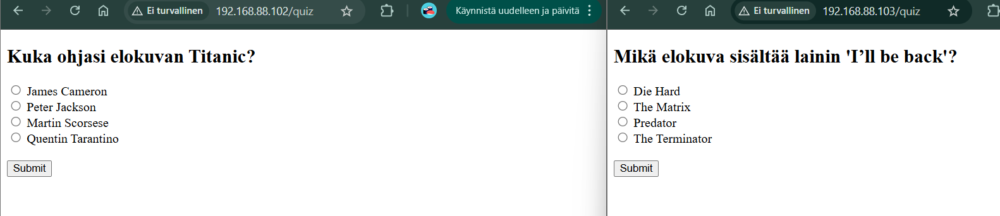

# Elokuvatrivia

Kahden tai useamman koneen elokuvatrivia-peli, joka asentuu automaattisesti Vagrantilla ja Saltilla.

## Projektin tarkoitus

Elokuvatrivia on Flaskilla toteutettu monivalintapeli, joka toimii usean virtuaalikoneen välillä Saltin hallinnoimana. Jokainen pelaaja vastaa kysymyksiin omalta koneeltaan, ja pelin asennus onnistuu yhdellä komennolla.
